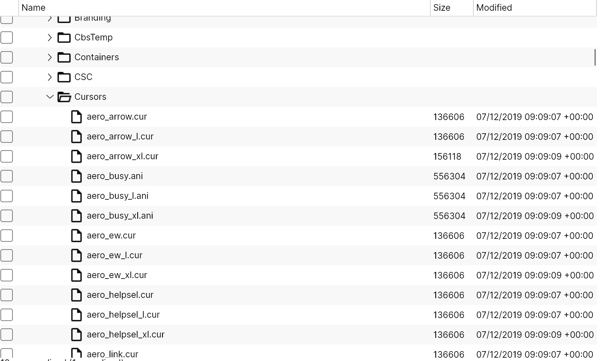
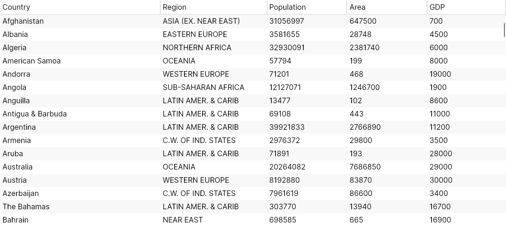

[](https://www.nuget.org/packages/TreeDataGrid/)

# `TreeDataGrid` for Avalonia

## Introduction

`TreeDataGrid` is a control for the [Avalonia](https://github.com/AvaloniaUI/Avalonia) UI framework which displays hierarchical and tabular data together in a single view. It is a combination of a `TreeView` and `DataGrid` control.

The control has two modes of operation:

- Hierarchical: data is displayed in a tree with optional columns
- Flat: data is displayed in a 2D table, similar to other `DataGrid` controls

An example of `TreeDataGrid` displaying hierarchical data:



An example of `TreeDataGrid` displaying flat data:



## Current Status

We accept all issues and pull requests but we answer and review only pull requests and issues that are high quality and align with project scope.

## Quick Start

Install the package:

```bash
dotnet add package TreeDataGrid
```

Or add a package reference:

```xml
<ItemGroup>
  <PackageReference Include="TreeDataGrid" Version="x.y.z" />
</ItemGroup>
```

Add the theme to `App.axaml`:

```xml
<Application xmlns="https://github.com/avaloniaui"
             xmlns:x="http://schemas.microsoft.com/winfx/2006/xaml"
             x:Class="AvaloniaApplication.App">
  <Application.Styles>
    <FluentTheme/>
    <StyleInclude Source="avares://Avalonia.Controls.TreeDataGrid/Themes/Fluent.axaml"/>
  </Application.Styles>
</Application>
```

## Basic Usage

### Flat mode

```csharp
using System.Collections.ObjectModel;
using Avalonia.Controls.Models.TreeDataGrid;

public class Person
{
    public string? FirstName { get; set; }
    public string? LastName { get; set; }
    public int Age { get; set; }
}

public class MainWindowViewModel
{
    private readonly ObservableCollection<Person> _people = new()
    {
        new() { FirstName = "Eleanor", LastName = "Pope", Age = 32 },
        new() { FirstName = "Jeremy", LastName = "Navarro", Age = 74 },
    };

    public FlatTreeDataGridSource<Person> Source { get; }

    public MainWindowViewModel()
    {
        Source = new FlatTreeDataGridSource<Person>(_people)
        {
            Columns =
            {
                new TextColumn<Person, string>("First Name", x => x.FirstName),
                new TextColumn<Person, string>("Last Name", x => x.LastName),
                new TextColumn<Person, int>("Age", x => x.Age),
            },
        };
    }
}
```

If you prefer to define columns in XAML in Avalonia 12, expose the raw collection instead:

```csharp
using System.Collections.ObjectModel;

public class MainWindowViewModel
{
    public ObservableCollection<Person> People { get; } = new()
    {
        new() { FirstName = "Eleanor", LastName = "Pope", Age = 32 },
        new() { FirstName = "Jeremy", LastName = "Navarro", Age = 74 },
    };
}
```

```xml
<TreeDataGrid ItemsSource="{Binding People}">
  <TreeDataGridTextColumn Header="First Name"
                          Binding="{Binding FirstName}"/>
  <TreeDataGridTextColumn Header="Last Name"
                          Binding="{Binding LastName}"/>
  <TreeDataGridTextColumn Header="Age"
                          Binding="{Binding Age}"/>
</TreeDataGrid>
```

### Hierarchical mode

```csharp
using System.Collections.ObjectModel;
using Avalonia.Controls.Models.TreeDataGrid;

public class Person
{
    public string? FirstName { get; set; }
    public string? LastName { get; set; }
    public int Age { get; set; }
    public ObservableCollection<Person> Children { get; } = new();
}

public class MainWindowViewModel
{
    private readonly ObservableCollection<Person> _people = new();

    public HierarchicalTreeDataGridSource<Person> Source { get; }

    public MainWindowViewModel()
    {
        Source = new HierarchicalTreeDataGridSource<Person>(_people)
        {
            Columns =
            {
                new HierarchicalExpanderColumn<Person>(
                    new TextColumn<Person, string>("First Name", x => x.FirstName),
                    x => x.Children),
                new TextColumn<Person, string>("Last Name", x => x.LastName),
                new TextColumn<Person, int>("Age", x => x.Age),
            },
        };
    }
}
```

Bind code-defined sources in XAML (both modes):

```xml
<TreeDataGrid Source="{Binding Source}" />
```

## Build and Package

Build/test/pack the library project:

```bash
dotnet restore src/Avalonia.Controls.TreeDataGrid/Avalonia.Controls.TreeDataGrid.csproj
dotnet build src/Avalonia.Controls.TreeDataGrid/Avalonia.Controls.TreeDataGrid.csproj -c Release --no-restore
dotnet test tests/Avalonia.Controls.TreeDataGrid.Tests/Avalonia.Controls.TreeDataGrid.Tests.csproj -c Release
dotnet pack src/Avalonia.Controls.TreeDataGrid/Avalonia.Controls.TreeDataGrid.csproj -c Release -o artifacts/packages
```

Packages are generated in `artifacts/packages` (`.nupkg` and `.snupkg`).

## Build Documentation

Build docs locally:

```bash
./build-docs.sh
```

Serve docs locally:

```bash
./serve-docs.sh
```

Default local URL: `http://127.0.0.1:8080`  
Override host/port with `DOCS_HOST` and `DOCS_PORT`.

Generated docs output is written to `site/.lunet/build/www`.

## Getting Started

- [Articles Home](site/articles/readme.md)
- [Installation](site/articles/getting-started/installation.md)
- [Quickstart Flat](site/articles/getting-started/quickstart-flat.md)
- [Quickstart Hierarchical](site/articles/getting-started/quickstart-hierarchical.md)
- [Columns, Cells, and Rows](site/articles/concepts/columns-cells-rows.md)
- [Selection Models](site/articles/concepts/selection-models.md)
- [Troubleshooting](site/articles/guides/troubleshooting.md)

## License

- Main project license: [licence.md](licence.md)
- Preserved original upstream license: [LICENSE-AVALONIA](LICENSE-AVALONIA)
