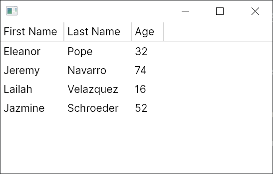

# Quickstart: Flat TreeDataGrid

This quickstart builds a complete flat (non-hierarchical) TreeDataGrid with editable text columns.

## Goal

Create a window showing a list of people with columns:

- First Name
- Last Name
- Age

## 1. Data Model

Create `Person.cs`:

```csharp
public class Person
{
    public string? FirstName { get; set; }
    public string? LastName { get; set; }
    public int Age { get; set; }
}
```

## 2. View Model with Flat Source

Create `MainWindowViewModel.cs`:

```csharp
using System.Collections.ObjectModel;
using Avalonia.Controls;
using Avalonia.Controls.Models.TreeDataGrid;

public class MainWindowViewModel
{
    private readonly ObservableCollection<Person> _people = new()
    {
        new Person { FirstName = "Eleanor", LastName = "Pope", Age = 32 },
        new Person { FirstName = "Jeremy", LastName = "Navarro", Age = 74 },
        new Person { FirstName = "Lailah", LastName = "Velazquez", Age = 16 },
        new Person { FirstName = "Jazmine", LastName = "Schroeder", Age = 52 },
    };

    public MainWindowViewModel()
    {
        Source = new FlatTreeDataGridSource<Person>(_people)
        {
            Columns =
            {
                new TextColumn<Person, string>(
                    "First Name",
                    x => x.FirstName,
                    (m, v) => m.FirstName = v),
                new TextColumn<Person, string>(
                    "Last Name",
                    x => x.LastName,
                    (m, v) => m.LastName = v),
                new TextColumn<Person, int>(
                    "Age",
                    x => x.Age,
                    (m, v) => m.Age = v ?? 0),
            },
        };

        // Optional: enable multiple row selection.
        Source.RowSelection!.SingleSelect = false;
    }

    public FlatTreeDataGridSource<Person> Source { get; }
}
```

Notes:

- `FlatTreeDataGridSource<TModel>` is the root source object.
- Each column is strongly typed and binds to model properties.
- Setter overloads make text cells editable.

## 3. Bind in XAML

Update `MainWindow.axaml`:

```xml
<Window xmlns="https://github.com/avaloniaui"
        xmlns:x="http://schemas.microsoft.com/winfx/2006/xaml"
        x:Class="AvaloniaApplication.MainWindow">
  <TreeDataGrid Source="{Binding Source}" />
</Window>
```

## 4. Set DataContext

Update `MainWindow.axaml.cs`:

```csharp
public partial class MainWindow : Window
{
    public MainWindow()
    {
        InitializeComponent();
        DataContext = new MainWindowViewModel();
    }
}
```

## 5. Run

Start the app and verify data appears:



## What You Have Now

- A fully bound flat TreeDataGrid
- Editable text cells
- Optional multi-row selection

## Common Next Steps

- Add `CheckBoxColumn` and `TemplateColumn`
- Configure sorting and widths
- Switch to cell selection

## Troubleshooting

- Feature behavior differs from expectations
Cause: one or more options in this scenario are configured differently (source type, column options, sort/selection/edit state).
Fix: compare your setup with the snippet in this article and verify runtime values on `Source`, `Columns`, and `Selection`.

- Data changes are not visible in UI
Cause: model or collection notifications are missing, or a replaced collection/source is not re-bound.
Fix: ensure `INotifyPropertyChanged`/`INotifyCollectionChanged` flow is active and reassign `Source` after replacing underlying collections.

## API Coverage Checklist

- <xref:Avalonia.Controls.TreeDataGrid>
- <xref:Avalonia.Controls.FlatTreeDataGridSource`1>
- <xref:Avalonia.Controls.Models.TreeDataGrid.TextColumn`2>

## Related

- [Flat Source Guide](../guides/sources-flat.md)
- [Text Column Guide](../guides/column-text.md)
- [Validation Snippets](../guides/validation-snippets.md)
- [Troubleshooting Guide](../guides/troubleshooting.md)
