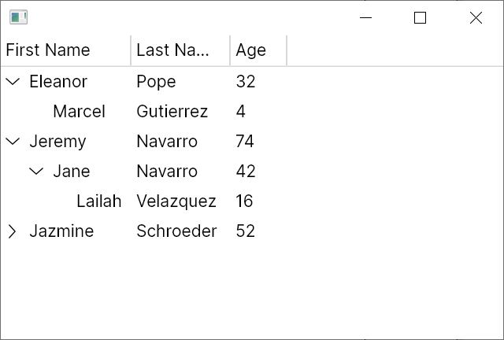

# Quickstart: Hierarchical TreeDataGrid

This quickstart builds a complete hierarchical TreeDataGrid with expandable rows.

## Goal

Create a parent/child dataset where each row can expand to show children.

## 1. Data Model

Create `Person.cs`:

```csharp
using System.Collections.ObjectModel;

public class Person
{
    public string? FirstName { get; set; }
    public string? LastName { get; set; }
    public int Age { get; set; }
    public ObservableCollection<Person> Children { get; } = new();
}
```

## 2. View Model with Hierarchical Source

Create `MainWindowViewModel.cs`:

```csharp
using System.Collections.ObjectModel;
using Avalonia.Controls;
using Avalonia.Controls.Models.TreeDataGrid;

public class MainWindowViewModel
{
    private readonly ObservableCollection<Person> _people = new()
    {
        new Person
        {
            FirstName = "Eleanor",
            LastName = "Pope",
            Age = 32,
            Children =
            {
                new Person { FirstName = "Marcel", LastName = "Gutierrez", Age = 4 },
            }
        },
        new Person
        {
            FirstName = "Jeremy",
            LastName = "Navarro",
            Age = 74,
            Children =
            {
                new Person
                {
                    FirstName = "Jane",
                    LastName = "Navarro",
                    Age = 42,
                    Children =
                    {
                        new Person { FirstName = "Lailah", LastName = "Velazquez", Age = 16 },
                    }
                }
            }
        },
    };

    public MainWindowViewModel()
    {
        Source = new HierarchicalTreeDataGridSource<Person>(_people)
        {
            Columns =
            {
                new HierarchicalExpanderColumn<Person>(
                    new TextColumn<Person, string>("First Name", x => x.FirstName),
                    x => x.Children),
                new TextColumn<Person, string>("Last Name", x => x.LastName),
                new TextColumn<Person, int>("Age", x => x.Age),
            },
        };

        // Optional: expand first root row at startup.
        Source.Expand(new IndexPath(0));
    }

    public HierarchicalTreeDataGridSource<Person> Source { get; }
}
```

Important:

- Hierarchical sources require exactly one expander column.
- `HierarchicalExpanderColumn<TModel>` wraps an inner column and child selector.

## 3. Bind in XAML

```xml
<Window xmlns="https://github.com/avaloniaui"
        xmlns:x="http://schemas.microsoft.com/winfx/2006/xaml"
        x:Class="AvaloniaApplication.MainWindow">
  <TreeDataGrid Source="{Binding Source}" />
</Window>
```

## 4. Set DataContext

```csharp
public partial class MainWindow : Window
{
    public MainWindow()
    {
        InitializeComponent();
        DataContext = new MainWindowViewModel();
    }
}
```

## 5. Run

Verify expansion behavior:



## What You Have Now

- A bound hierarchical source
- Expand/collapse row behavior
- Multiple columns in hierarchical mode

## Common Next Steps

- Handle expansion events (`RowExpanding`, `RowExpanded`)
- Programmatically expand/collapse ranges
- Add custom cell templates

## Troubleshooting

- Feature behavior differs from expectations
Cause: one or more options in this scenario are configured differently (source type, column options, sort/selection/edit state).
Fix: compare your setup with the snippet in this article and verify runtime values on `Source`, `Columns`, and `Selection`.

- Data changes are not visible in UI
Cause: model or collection notifications are missing, or a replaced collection/source is not re-bound.
Fix: ensure `INotifyPropertyChanged`/`INotifyCollectionChanged` flow is active and reassign `Source` after replacing underlying collections.

## API Coverage Checklist

- <xref:Avalonia.Controls.TreeDataGrid>
- <xref:Avalonia.Controls.HierarchicalTreeDataGridSource`1>
- <xref:Avalonia.Controls.Models.TreeDataGrid.HierarchicalExpanderColumn`1>

## Related

- [Hierarchical Source Guide](../guides/sources-hierarchical.md)
- [Hierarchical Expander Column Guide](../guides/column-expander.md)
- [Validation Snippets](../guides/validation-snippets.md)
- [Troubleshooting Guide](../guides/troubleshooting.md)
